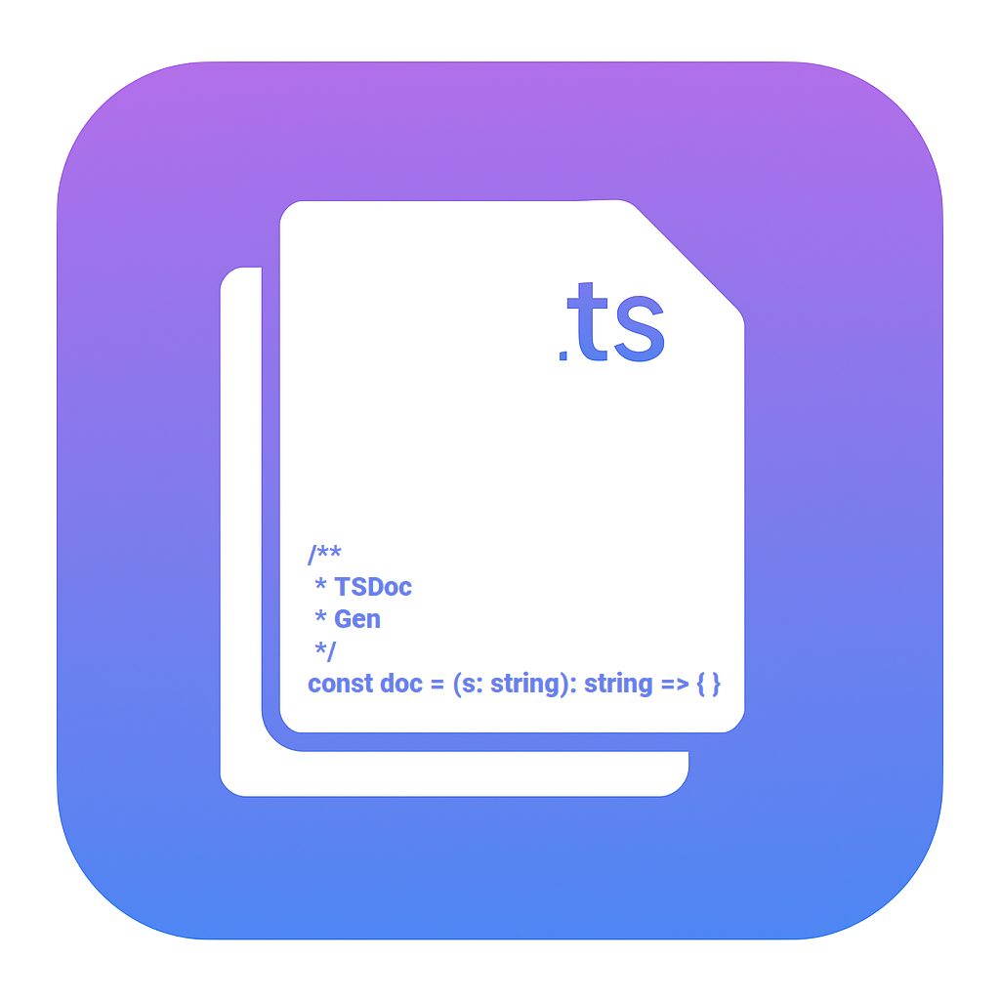

# TSDoc Gen

Create consistent TSDoc comments from your TypeScript source using precise AST parsing. Includes support for functions, classes, methods, and more—with configurable templates.

---



[](https://github.com/apopovicius/tsdoc-gen/actions/workflows/ci.yml)

---

## ✨ Features

- Generate `/** ... */` TSDoc blocks for functions, classes, and more
- Works with both manual commands and inline `/*!` triggers
- AST-powered — not regex or heuristics
- Configurable: return suppression, empty param blocks, trigger keyword

---

## ⚙️ Requirements

No additional dependencies. Requires VS Code and TypeScript syntax support.

---

## 🔧 Extension Settings

You can configure **TSDoc Gen** to suit your preferences via the Visual Studio Code settings UI.

### How to Access Extension Settings

1. Go to the **Extensions** sidebar in VS Code (`Ctrl+Shift+X`).
2. Search for **`tsdoc-gen`**.
3. Click the gear icon ⚙ next to the extension name.
4. Select **Extension Settings**.

Alternatively, open the settings directly by entering the following in the Command Palette (`Ctrl+Shift+P`):

```plaintext
Preferences: Open Settings (UI)
```

Then search for:

```plaintext
@ext:vicius.tsdoc-gen
```

---

### Available Settings

| Setting                       | Description                                                                                                               |
| ----------------------------- | ------------------------------------------------------------------------------------------------------------------------- |
| **Include Empty Param Block** | If enabled, includes an empty `@param` block even when the function or class has no parameters.                           |
| **Include Returns For Void**  | If enabled, adds a `@returns` tag even when the function returns `void` or `undefined`.                                   |
| **Trigger Keyword**           | Defines the special keyword (default: `/*!`) that triggers automatic TSDoc comment generation when typed on its own line. |

---

## 🚀 Usage

The **TSDoc Gen** extension supports multiple ways to generate documentation comments:

### 🖐️ Manual

You can manually trigger TSDoc comment generation by:

1. Placing your cursor above a function, method, or class declaration.
2. Opening the Command Palette (`Ctrl+Shift+P` / `Cmd+Shift+P` on macOS).
3. Running: `TSDoc Gen: Generate TSDoc Comment`.

A properly formatted TSDoc comment will be inserted based on the detected symbol.

### 💡 Inline Trigger

Typing the following keyword on its own line will automatically generate a TSDoc comment:

```
/*!
```

This works when placed immediately above a declaration.

> 💡 You can configure the trigger keyword in the extension settings.

### 📋 Context Menu

You can also generate a TSDoc comment using the right-click context menu:

1. Right-click anywhere above a TypeScript function, class, or method.
2. Click **"Generate TSDoc Comment"** from the context menu.

This provides a quick way to use the extension without keyboard commands.

---

## 📌 Example

Before:

```ts
function add(a: number, b: number): number {
  return a + b;
}
```

Trigger: `/*!`

After:

```ts
/**
 * TODO: Describe the add function.
 * @param a {number} - Description
 * @param b {number} - Description
 * @returns number
 */
function add(a: number, b: number): number {
  return a + b;
}
```

---

## 🐞 Known Issues

- Interface method support coming soon
- No AI-powered suggestions yet

---

## 📄 License

MIT © 2025 Andrei Popovici
