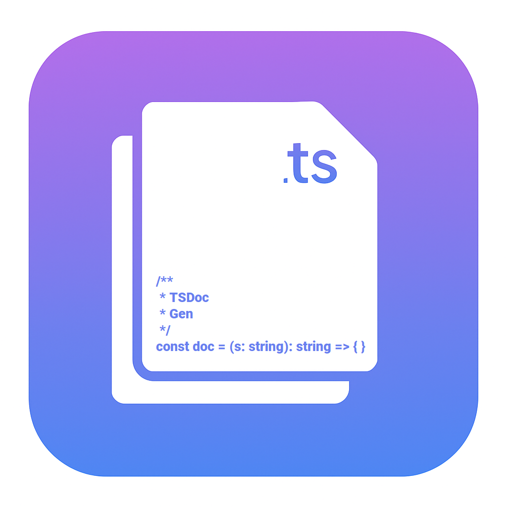

<div align="left" style="display: flex; align-items: center; gap: 1em;">
  

  <div>
    <p style="margin: 0;"><font size="6"><b><strong>TSDoc Gen</strong></b></font></p>
    <p style="margin: 0;">
      Create consistent TSDoc comments from your TypeScript source using precise AST parsing. Includes support for functions, classes, methods, and more—with configurable templates.
    </p>
  </div>
</div>

<br/>

[](https://github.com/apopovicius/tsdoc-gen/actions/workflows/ci.yml)

## Features

- Generate `/** ... */` TSDoc blocks for functions, classes, and more
- Works with both manual commands and inline `/*!` triggers
- AST-powered — not regex or heuristics
- Configurable: return suppression, empty param blocks, trigger keyword

## Requirements

No additional dependencies. Requires VS Code and TypeScript syntax support.

## Extension Settings

This extension contributes the following settings:

| Setting                           | Description                                                              |
| --------------------------------- | ------------------------------------------------------------------------ |
| `tsdocGen.triggerKeyword`         | Custom trigger comment for auto-generation                               |
| `tsdocGen.includeReturnsForVoid`  | Include `@returns` even if return type is `void`, `undefined`, or `null` |
| `tsdocGen.includeEmptyParamBlock` | Include `@param` block even when there are no parameters                 |

## Usage

### Manual

Use the command palette (`Ctrl+Shift+P` or `Cmd+Shift+P`) and run:

```
Generate TSDoc Comment
```

Or use the default keybinding:

```
Ctrl+Alt+D
```

### Inline Trigger

Type this on a line above your code:

```ts
/*!
```

…and the extension will replace it with a generated TSDoc comment.

## Example

Before:

```ts
function add(a: number, b: number): number {
  return a + b;
}
```

Trigger: `/*!`

After:

```ts
/**
 * TODO: Describe the add function.
 * @param a {number} - Description
 * @param b {number} - Description
 * @returns number
 */
function add(a: number, b: number): number {
  return a + b;
}
```

## Known Issues

- Interface method support coming soon
- Multiline types not yet auto-wrapped
- No AI-powered suggestions yet

## Release Notes

### 0.1.0

Initial release with:

- Support for functions, classes, methods, arrow functions, and properties
- Inline `/*!` trigger
- Smart `@returns` and `@param` logic with config

---

## Working on this Extension

To test or contribute:

```bash
npm install
npm run compile
```

Then press `F5` in VS Code to launch the extension in a dev host.

You can package it locally with:

```bash
npm install -g vsce
vsce package
```

## License

MIT © 2025 Andrei Popovici
